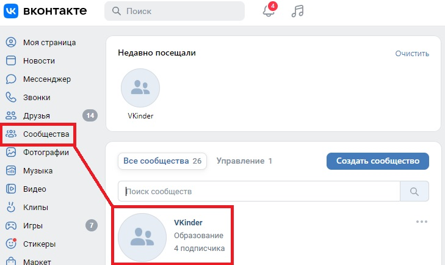
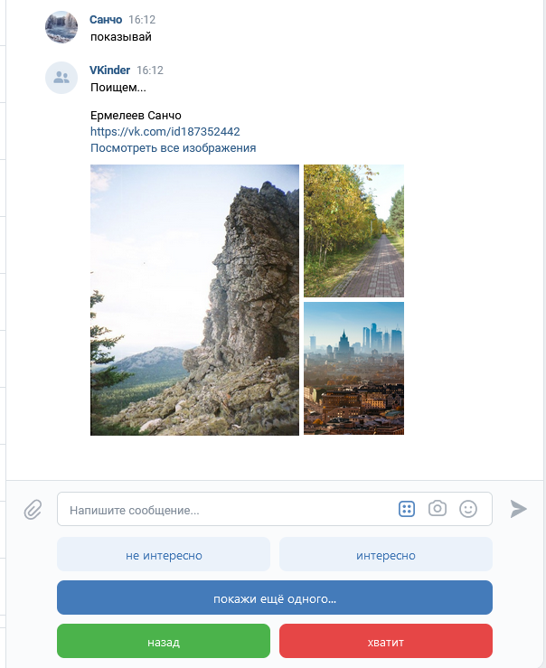

# Team-project-VKinder

    Руководство пользователя.

1.	[Введение](#введение)
2.	[Область применения](#область-применения)
3.	[Краткое описание возможностей](#краткое-описание-возможностей)
4.	[Подготовка к работе](#подготовка-к-работе)
5.	[Порядок работы бота](#5.-порядок-работы-бота)

## 1. Введение
Программа-бота для взаимодействия с базами данных социальной сети. Бот 
будет предлагать различные варианты людей для знакомств в социальной сети 
ВКонтакте в виде диалога с пользователем.

## 2. Область применения

Приложение предназначено для работы в сообществе сети «Вконтакте».

## 3.	Краткое описание возможностей

Чат - бот предназначен для поиска людей (пользователей социальной сети  
«Вконтакте») для знакомства. Чат - бот может быть интегрирован в сообщество 
пользователей социальной сети «Вконтакте».

## 4.	Подготовка к работе

Для использования приложения чат - бота пользователю необходимо быть 
зарегистрированном в социальной сети «Вконтакте» и входить в сообщество 
пользователей, в котором расположен чат - бот. Подробная инструкция для 
регистрации приложена ниже.

Инструкция по регистрация пользователя в социальной сети «Вконтакте»: 
https://fonarikitop.ru/kak-zaregistrirovatsya-v-vk-v-2022-godu-polnaya-instrukciya/?ysclid=lakxaunf8c6222813

Инструкция по вступлению в сообщество социальной сети «Вконтакте»: 
https://faqkontakt.ru/kak-vstupit-v-gruppu-v-vk/?ysclid=lakxhpnbne765347757

Для работы самого бота ОБЯЗАТЕЛЬНЫМ является лишь ТОКЕН сообщества, логин, 
пароль и название базыданных, с которой предполагается работа бота. Для 
создания всех необходимых таблиц, к проекту также приложены все необходимые 
[файлы](docs/sql_files_and_shema/) с SQL запросами. Альтернативным 
вариантом может быть самостоятольный запуск модуля [db.py](src/modules/).
Данный модуль создаст в указанной базе данных все необходимые таблицы. 
Опциональными параметрами для запуска являются токен и id администратора 
бота. Если их предоставить то запус бота происходит бысто, что очень 
полезно для разработки, в ином случае, при запуске основного запускающего 
файла [vkbot.py](src/modules/) программа сама проверить наличие и 
актуальность переданных ей опциональных параметров, если они не актуальны 
(или их не передали), то будет запущен модуль авторизации пользователя, 
выполнить которую необходимо за 3 минуты... После выполнения авторизации, 
программа в консоль выведет полученный вами токен (его можно будет 
сохранить на тот случай, если в дальнейшем нужна будет возможность более 
быстрого запуска программы). Работа функции авторизации проверена на 
Windows 10 и Linux Ubuntu со snap пакетом Firefox (из-за особенностей 
работы - используется драйвер Firefox snap пакета). После прохождения 
авторизации, бот - запущен.

## 5.	Порядок работы бота

Необходимо войти в сообщество, в котором существует чат — бот. Для этого  
необходимо в меню в левой части экрана выбрать «сообщества».

Далее, находясь на страницы сообщества необходимо в правой части экрана 
выбрать  сообщения. Затем в всплывающем меню необходимо указать название 
Вашего  чата, в котором будет работать бот.

Затем необходимо отправить сообщение 'bot' для запуска бота. О том, что бот 
начал работу, можно судить о выведенном в чате сообщении и о изменившемся 
интерфейсе диалогового окна. Нажатие кнопки "хватит" (в любом меню) 
закончит теукщий диалог с ботом. Отправив сообщение "bot", данный диалог можно 
будет начать повторно. 

Нажатие кнопки "Найти Далёких странников" позволит перейти к меню выбора 
вариантов просмотра пользователей.

Далее все интуитивно понятно по интерфейсу чата. Выбрав "найти новых людей" 
вы перейдёте в меню выбора критериев их поиска, некоторые из которых можно 
будет поменять...
Обо всех текущих критериях и при их изменении бот будет сообщать...

Нажатие кнопки "показывай" перебросит вас в меню просмотра пользователей. 
Каждого пользователя который вам понравился вы можете добавить в 
"Избранное", нажав кнопку "интересно", и наоборот, если вы не хотите, чтобы 
данного пользователя бот вам показывал - добавьте его в "черный список", 
нажав кнопку "неинтересно".

В боте реализована опция просмотра списка "избранных" и "черного списка" в 
в окне диалога вариантов просмотра. Что бы преступить к их просмотру 
нажмите соответствующую кнопку "показать избранных" или "показать 
неинтересных" - вы перейдете в меню их просмотра...

ВАЖНО! Сервисное сообщение "exit", отправленное с учетной записи 
пользователя админа (id-пользователя, токен которого применялся для запуска 
бота) штатно останавливает работу бота, всем "клиентам" бота, которые вели 
с ним диалог прийдет уведомление о том, что работа бота была прекращена 
администратором сообщества.

