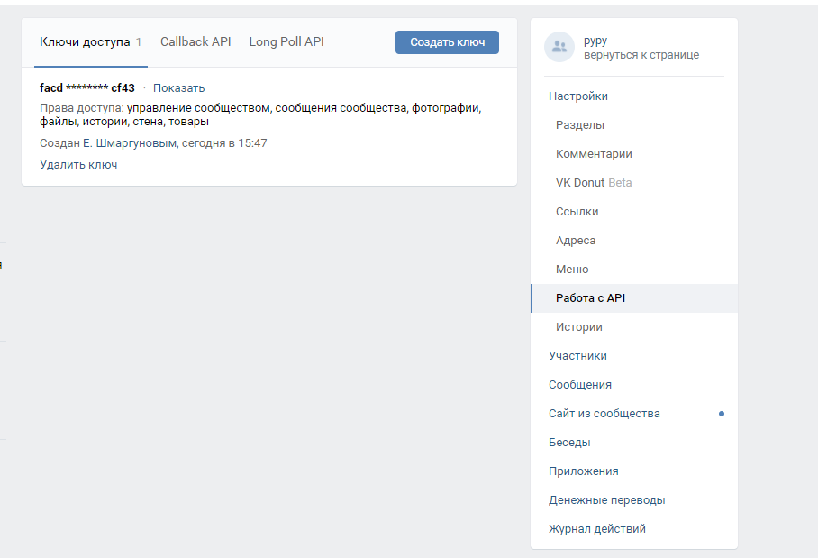
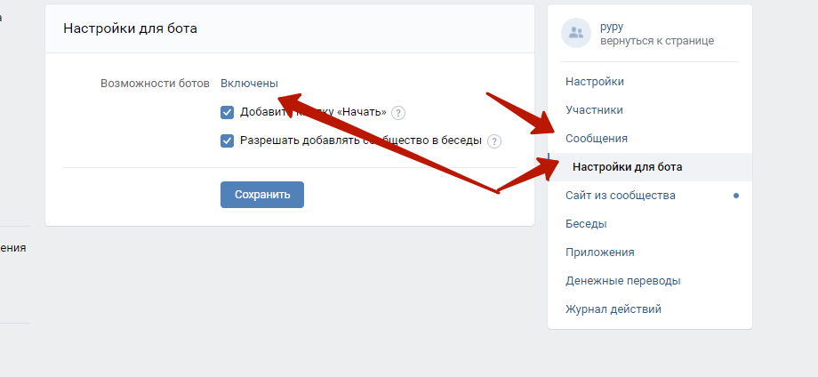

# Как настроить группу для бота и получить токен

## Для создания токена для бота нужно
1. Создать группу в VK
2. Зайти в Управление -> Работа с API. Создать ключ.
3. Нажать "Показать". Скопировать ключ в Вашу программу. Это будет вашим токен для запросов от группы.

4. Включить возможность писать сообщения в группу. Управление -> Сообщения -> Сообщения сообщества: включить.
5. Настройки бота. Возможности бота: Включены

