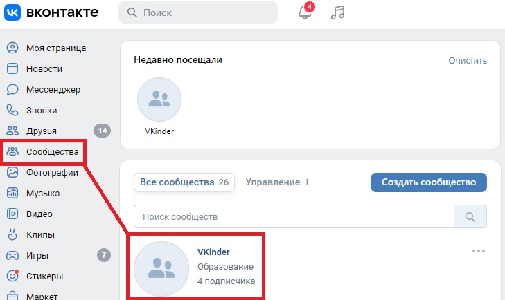
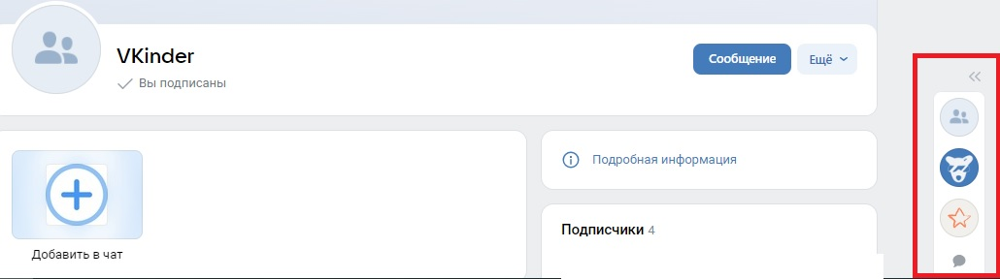
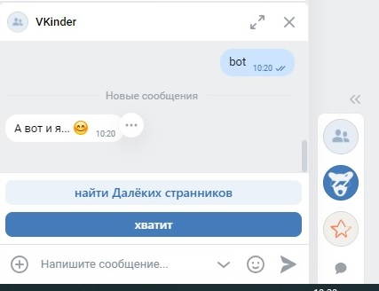
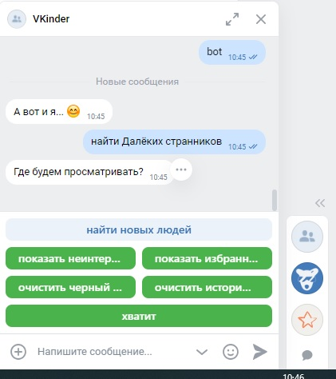
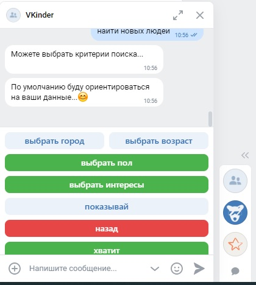
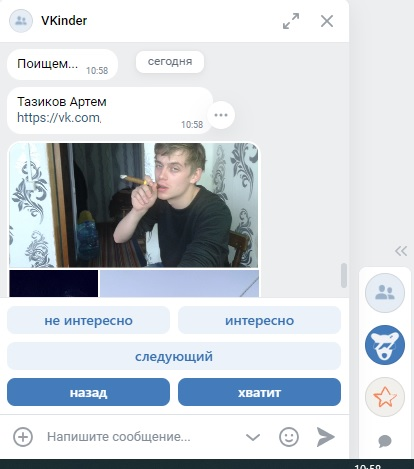

# Руководство пользователя.

1.	Введение
2.	Область применения
3.	Краткое описание возможностей
4.	Подготовка к работе
5.	Порядок работы бота

## 1. Введение
Программа-бота для взаимодействия с базами данных социальной сети. Бот будет предлагать различные варианты людей для знакомств в социальной сети ВКонтакте в виде диалога с пользователем.

## 2. Область применения

Приложение предназначено для работы в сообществе сети «Вконтакте».

## 3.	Краткое описание возможностей

Чат - бот предназначен для поиска людей (пользователей социальной сети «Вконтакте») для знакомства. Чат - бот может быть интегрирован в сообщество пользователей социальной сети «Вконтакте».

## 4.	Подготовка к работе

Для использования приложения чат - бота пользователю необходимо быть зарегистрированном в социальной сети «Вконтакте» и входить в сообщество пользователей, в котором расположен чат - бот. Подробная инструкция для регистрации приложена ниже.

Инструкция по регистрация пользователя в социальной сети «Вконтакте»: https://fonarikitop.ru/kak-zaregistrirovatsya-v-vk-v-2022-godu-polnaya-instrukciya/?ysclid=lakxaunf8c6222813

Инструкция по вступлению в сообщество социальной сети «Вконтакте»: https://faqkontakt.ru/kak-vstupit-v-gruppu-v-vk/?ysclid=lakxhpnbne765347757

## 5.	Порядок работы бота

Необходимо войти в сообщество, в котором существует чат — бот. Для этого необходимо в меню в левой части экрана выбрать «сообщества».

Далее, находясь на страницы сообщества необходимо в правой части экрана выбрать сообщения. Затем в всплывающем меню необходимо указать название Вашего чата, в котором будет работать бот.

Затем необходимо ввести 'bot' для запуска бота.

После приветствия чат-бот начнет свою работу. О том, что бот начал работу успешно можно судить о выведенном сообщении в чате.

Далее все интуитивно понятно по интерфейсу чата.

При выборе листа избранного (с помощью команды «Показать список избранных») выводиться информация о пользователях добавленных в этот список, и т.д.

Для того чтобы закончить работу чат-бота нужно ввести 'exit'.
